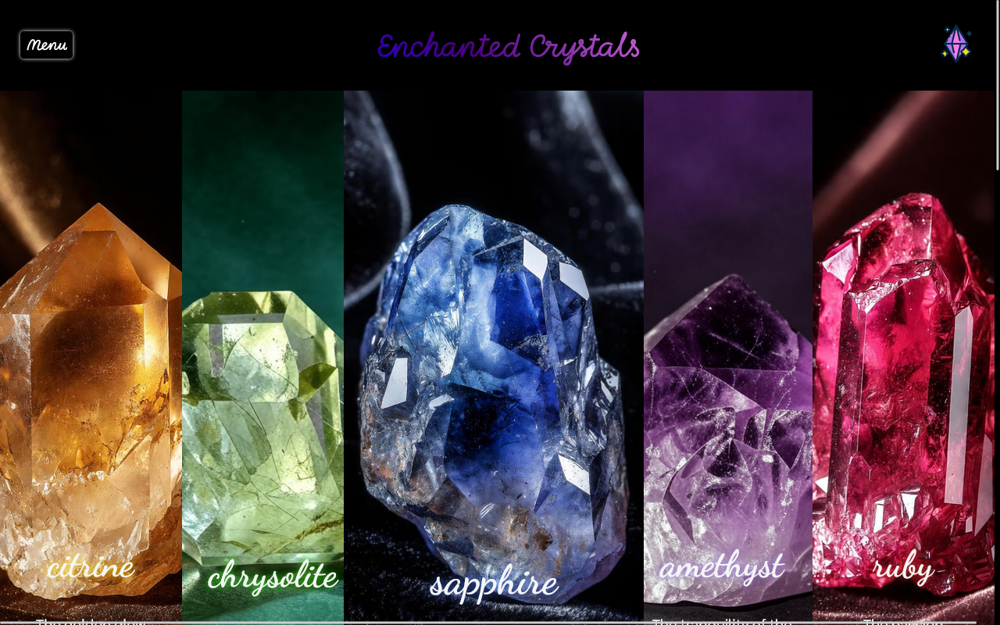
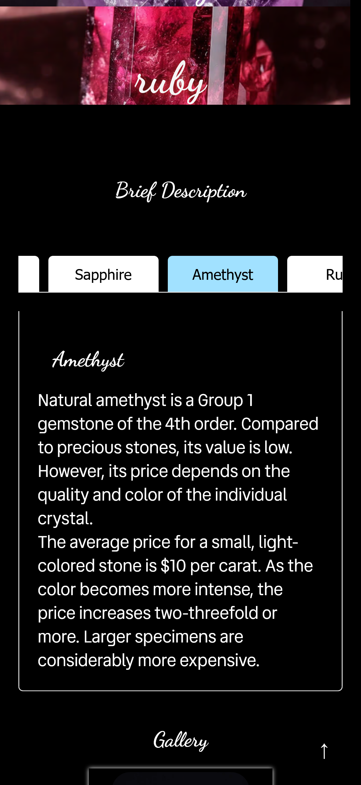
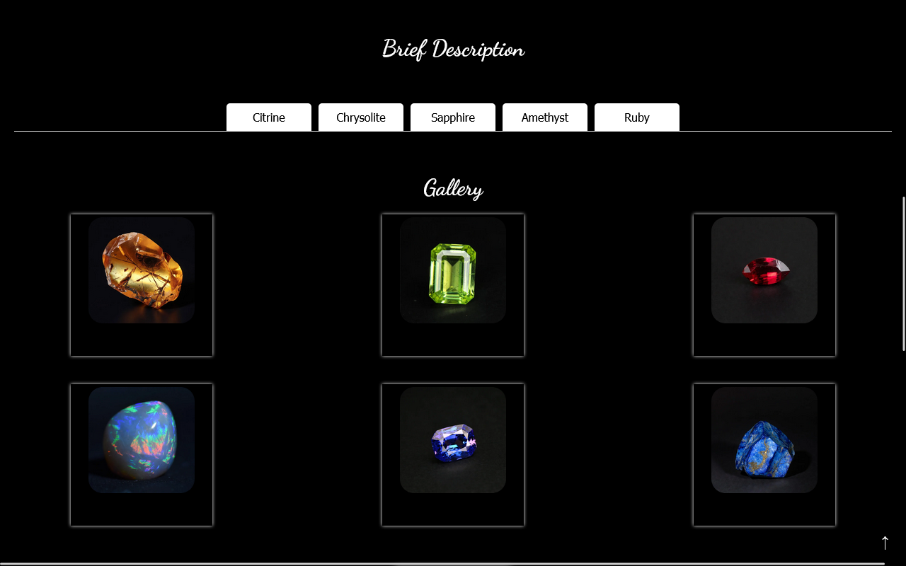
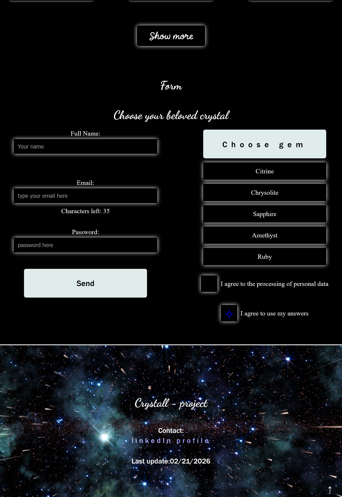

# Enchanted Crystals
Пет-проект на React, созданный для демонстрации навыков создания Single Page Application с галереей и React-hook-form.

## О проекте
«Enchanted Crystals» — атмосферный одностраничный сайт, посвящённый кристаллам.  
Полноценное SPA-приложение на React (через Create React App).  
Проект включает описание, галерею и форму.

## Скриншоты
1. Главный экран ;
2. Описание камня ;
3. Галерея ;
4. Форма;

## Использованные технологии
- React (функциональные компоненты, хуки);
- Create React App (Webpack, Babel, ESLint);
- JavaScript (ES6+);
- Адаптивная вёрстка;

## Основные возможности проекта
- Главная секция с атмосферным заголовком «Enchanted Crystals»;
- Подробное описание кристаллов и их свойств;
- Интерактивная галерея;
- Форма;
- Адаптивный дизайн под все устройства;
- Чистая компонентная архитектура React;
